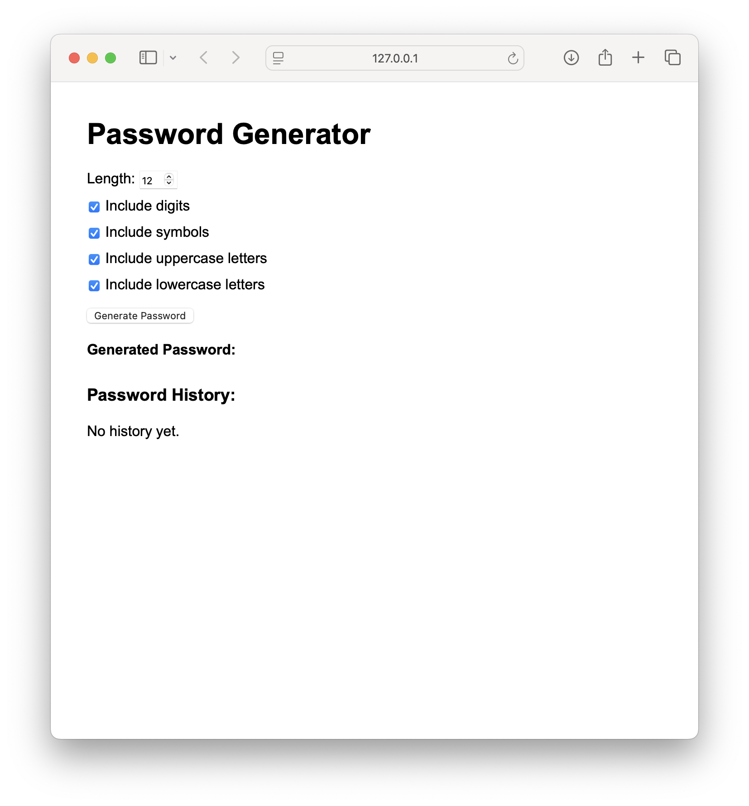
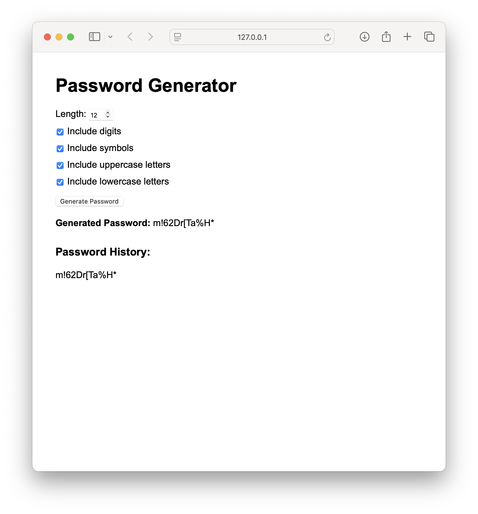
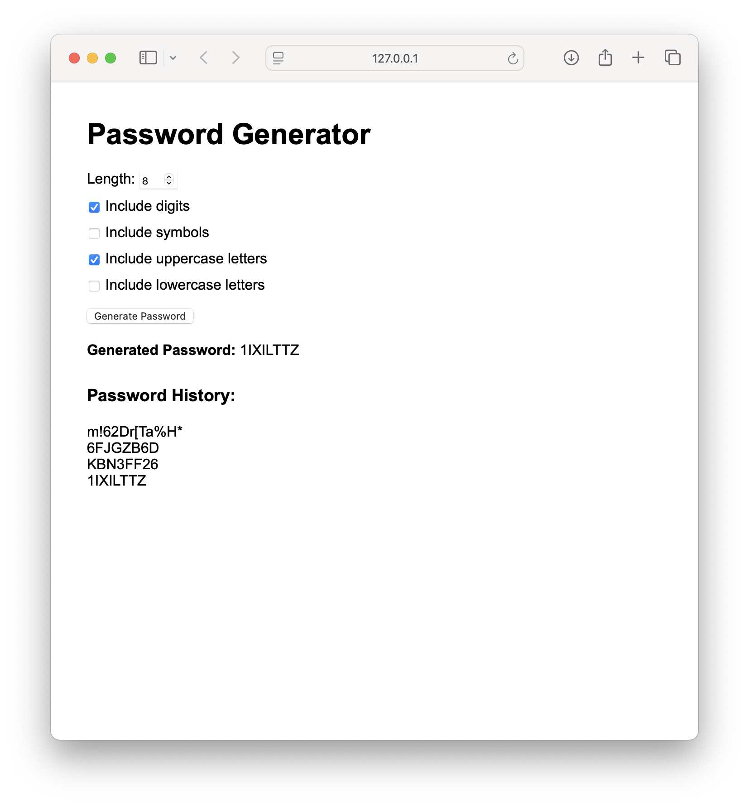
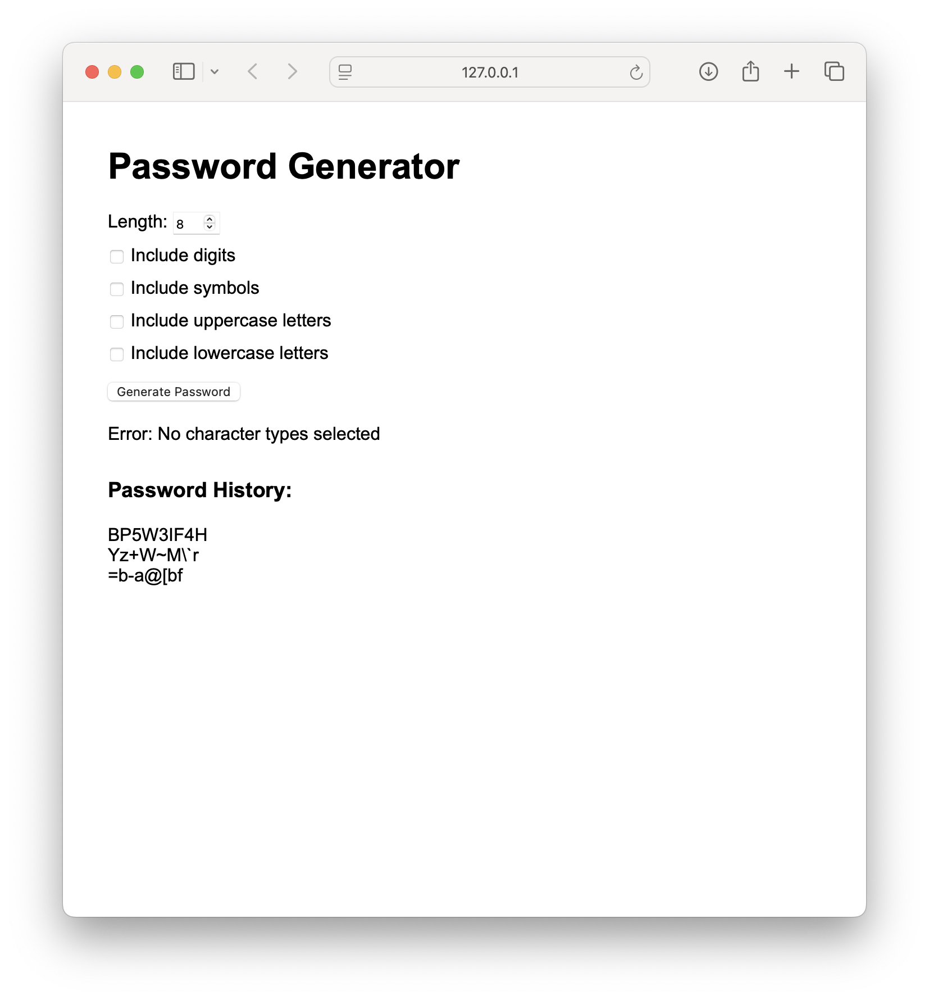

### Курсова робота Методології та технології розробки програмного забезпечення
#### Генератор паролів 
Виконала: Юхненко Віолетта

### 1. Клонування репозиторію

```bash 
git clone https://github.com/wiiiolettaaaaa/CourseworkMTRPZ.git
cd CourseworkMTRPZ
```

### 2. Запуск тестів локально

```bash
cd password-generator/tests
python -m unittest test_generator
```
### 3. Автоматичне тестування через GitHub Actions

При кожному коміті у main , тести запускаються автоматично у GitHub Actions. Щоб переглянути результати тестів на GitHub:

1. Перейдіть у [репозиторій](https://github.com/wiiiolettaaaaa/CourseworkMTRPZ).
2. Відкрийте вкладку Actions.
3. Виберіть останній запуск тестів.
4. Перегляньте лог виконання тестів.

### 4. Запуск проєкту
```bash
cd password-generator 
docker compose down
docker compose up --build

```

У браузері відкрити посилання що зʼявиться 

На сайті можна обрати довжину пароля та вміст (цифри, великі літери, малі літери, символи)

Інтерфейс та робота програми:







